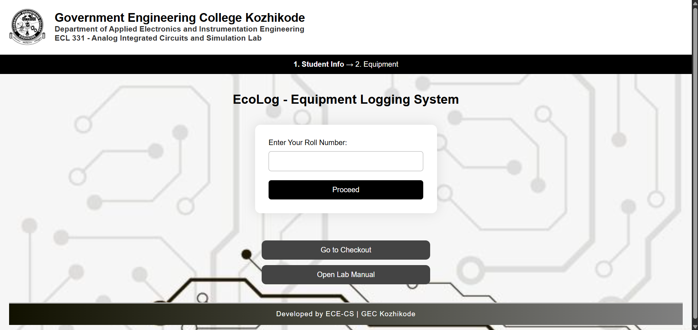
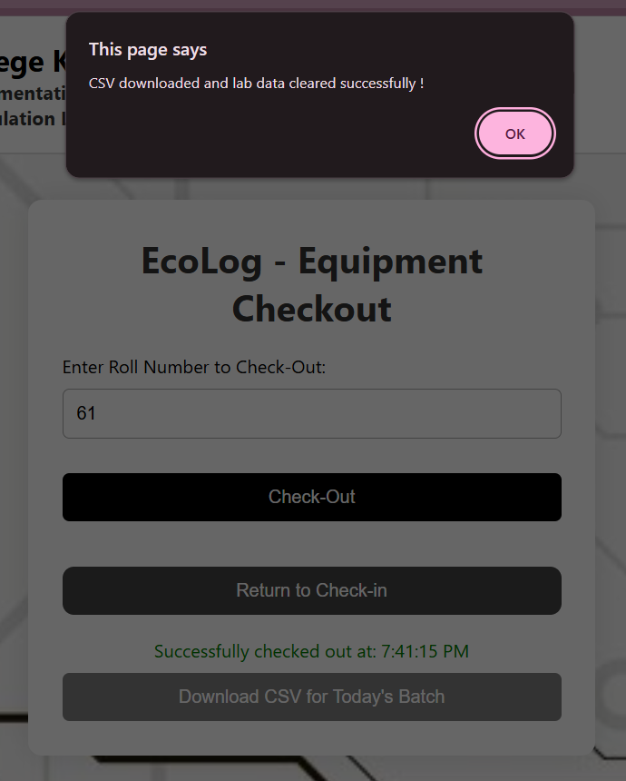

# EcoLog☘️🖥️
 EcoLog is a web-based lab management system developed for the Analog Integrated Circuits and Simulation Lab (ECL 331) at GEC Kozhikode. 

---

## 📌 Key Highlights

- Check in and log equipment usage.
- Record experiments and components used.
- Automatically manage batch-wise student data.
- Check out equipment and download daily CSV records.
- Reduce manual record-keeping errors and provide an efficient way to track lab equipment usage, experiments, and student participation
 

---

## Platform

- Web-based application running in any modern browser (Chrome, Edge, Firefox)  

## Data Storage
- Uses localStorage in the browser for temporary batch data
- Allows CSV export for permanent record-keeping

## Frontend
- HTML, CSS, JavaScript
- Responsive design for desktops and tablets
- Interactive forms for student info and equipment selection

## Database
- StudentDB.js contains preloaded student details (roll number, batch, name)
- Organized by Batch 1 & Batch 2

---

## Site Preview

Student opens index.html :

Redirected to equipment.html :

  

For check-out, student goes to checkout.html : 

 

---

## 🎥 Simulation Video

[📺 Watch the EcoLog video](<https://drive.google.com/file/d/1hWyIHzYPpkhUtfKRcJ5tWrwfbkv2fItj/view?usp=sharing>)

---

## 👩‍💻 Author

**Shreya S N**  
BTech ECE | GECK | APJAKTU  
2025  
